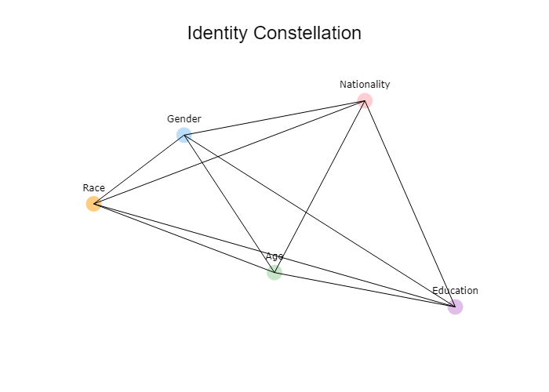

# Identity Constellation Generator

This project creates an interactive web application using Streamlit and Plotly to generate a scatter plot with a constellation effect based on user inputs for identity dimensions such as race, gender, age, nationality, and education level.

## Features

- User input for identity dimensions (race, gender, age, nationality, education).
- Color-coded scatter plot based on user inputs.
- Constellation effect with lines connecting the identity points.
- Customizable layout to resemble a celestial map.
- Saves the figure as both a PNG image and an HTML file.
- Opens the HTML file directly to display the identity constellation graph.

## Requirements

- Python 3.x
- Streamlit
- Plotly
- Pandas
- Numpy
- Kaleido (for saving the figure as an image)

## Installation

1. **Install the required libraries**:
    ```sh
    pip install -r requirements.txt
    ```

## Usage

1. **Run the Streamlit application**:
    - Navigate to the project directory in your terminal.
    - Execute the following command:
        ```sh
        streamlit run app.py
        ```
    - Replace `app.py` with the actual script name if different.

2. **Interact with the web app**:
    - Open the URL provided by Streamlit in your web browser.
    - Input your values for race, gender, age, nationality, and education level.
    - Click the "Submit" button to generate the constellation plot.

3. **View the output**:
    - The interactive plot will be displayed in the web app.
    - The plot will also be saved as `identity_constellation.png` and `identity_constellation.html` in your working directory.
    - The HTML file will open automatically to display the identity constellation graph.

## Example

Here's a sample of what the plot looks like:



## Acknowledgements

- [Streamlit](https://streamlit.io/) for the web application framework.
- [Plotly](https://plotly.com/) for the interactive plotting library.
- [Pandas](https://pandas.pydata.org/) for data manipulation.
- [Numpy](https://numpy.org/) for numerical operations.
- [Kaleido](https://github.com/plotly/Kaleido) for image export.